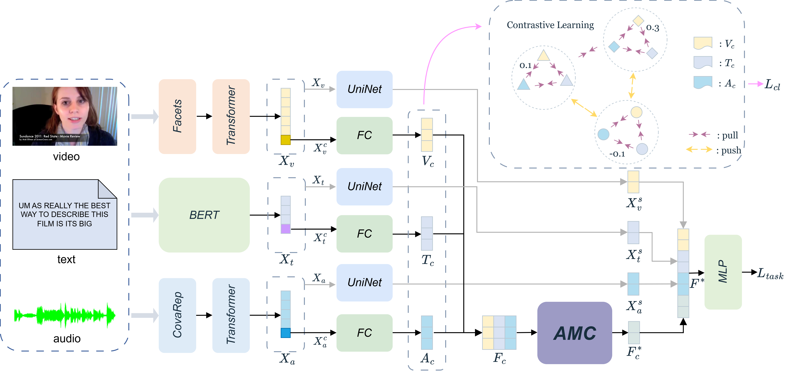
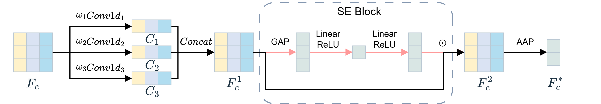

### AMCCL: Adaptive Multi-Scale Convolution Fusion Network with Contrastive Learning for Multimodal Sentiment Analysis

The offical code for the paper 《AMCCL: Adaptive Multi-Scale Convolution Fusion Network with Contrastive Learning for Multimodal Sentiment Analysis》.

My paper is under review at PRICAI 2025!🚀 🚀 🚀 

### ✨ Abstract

This paper introduces AMCCL, a novel method for MSA that aims to address the limitations of existing approaches in multimodal fusion and feature alignment. AMCCL employs an AMC module for dynamic fusion of multimodal information. This module incorporates a SE block to optimize channel weights, thereby capturing sentiment-relevant cues at varying granularities, enhancing feature expressiveness, and reducing redundant information. The AMC module demonstrates superior flexibility and adaptability, offering a novel fusion paradigm for MSA. Furthermore, we introduce a fine-grained contrastive learning method that constructs positive and negative sample pairs by integrating both sentiment polarity and sentiment intensity difference. This method designs novel contrastive loss functions, including a refine loss and a margin loss, significantly improving the precision of feature alignment and the quality of representation learning. Evaluations on the MOSI and MOSEI datasets demonstrate our model’s robustness and effectiveness, with results showing competitive performance.

### ✨ Requirements

- pytorch == 2.0.1+cu118
- transformers == 4.32.1
- python == 3.8

### 🚀 How to Run

- Download dataset from https://github.com/thuiar/MMSA
- Download bert-base-chinese and bert-base-uncased to project dir
- In "config\config_regression.py" set the file path to the path where your dataset files are located.
- python run.py

